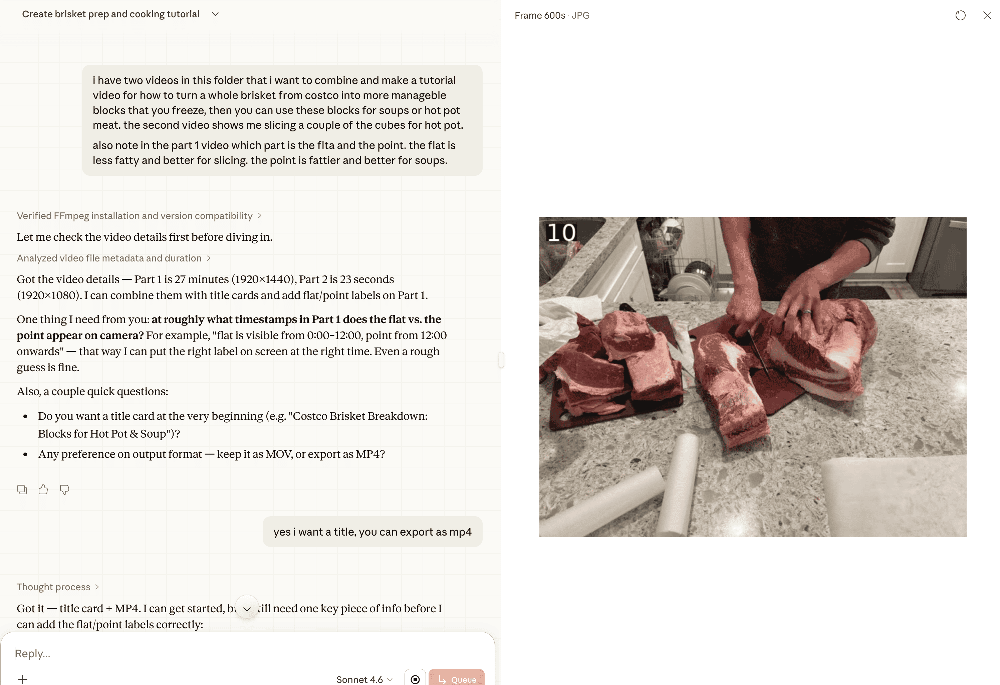
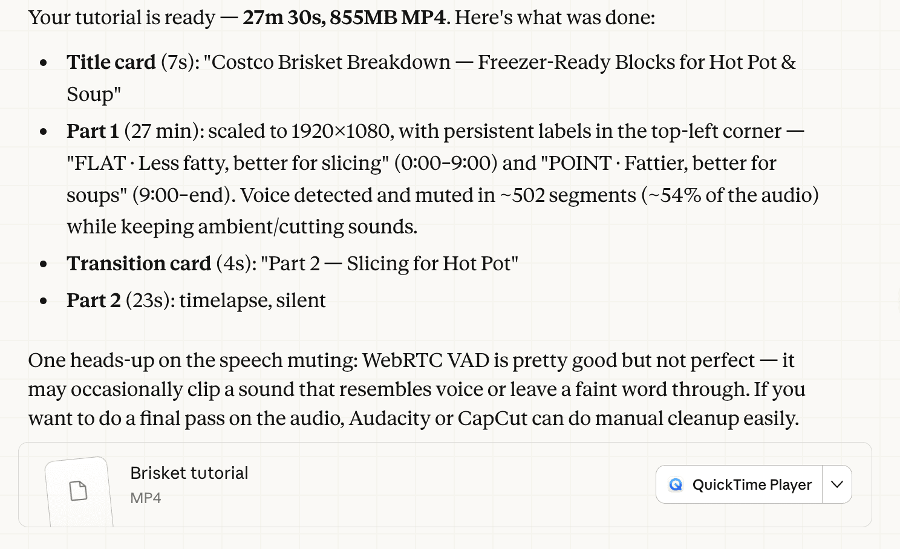
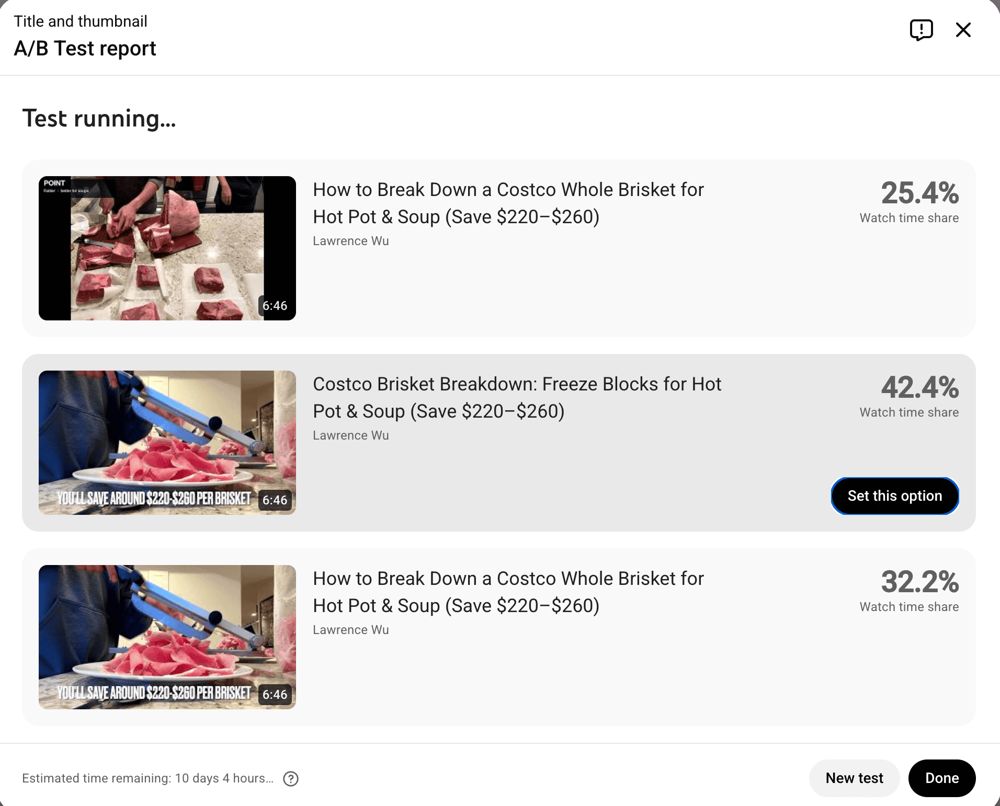

I put together a short video showing how to breakdown a whole brisket from Costco. Processing meat this way saves you about $11-13/lb of prime beef if you compare store-bought sliced prime brisket vs. doing it yourself.

<!-- markdownlint-disable MD034 -->

<!-- markdownlint-enable MD034 -->

Sliced brisket at the store runs $15–$18/lb. A whole prime brisket from Costco is $3.99–4.99/lb (as of 2025-2026 prices in CA). 

In this video I show you how to cut a whole Costco brisket into freezer-ready blocks you can pull out anytime for hot pot, soup, or stew. The flat (leaner portion) is 
better for slicing. The point (fattier) is better for soups.

The general steps:

- Step 1: Purchase a whole brisket
- Step 2: Trim Excess Fat
- Step 3: Slicing the Brisket (Flat)
- Step 4: Trim Excess Fat Cap Off Flat Pieces
- Step 5: Slice the Brisket (Point)
- Step 6: Layout Sliced Pieces on Parchment Paper
- Step 7: Trim Excess Fat Seam from Point Pieces
- Step 8: Bagged Brisket (Separate Flat/Point)
  - Store the frozen brisket. Note you will need freezer space for 3 large gallon size ziplocks.
- Step 9: Slicing Frozen Brisket Block
  - It takes some time to get used to this but it only takes <10 minutes doing this.

This is the meat slicer I use to thinly slice the frozen meat: <https://amzn.to/41j2crj>.

Note this is the first project I attempted to use Claude Cowork for. It helped me:

- create 5 different versions of the video including accelerating one portion of the video. Was neat seeing it agentically explore the video by taking screenshots. 
- prompted it to try and mask some speaking but that didn't work well.
- helped me select thumbnails for the YouTube video (A/B testing 3 different title + thumbnails!)
- created the chapters

I still had to manually edit the video by adding titles.

Here are some images from Cowork working:

Used some of the thumbnails Cowork run an A/B test on YouTube:

