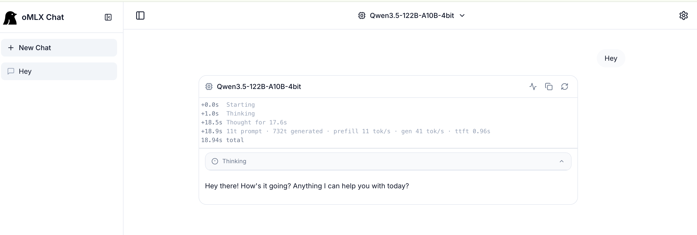
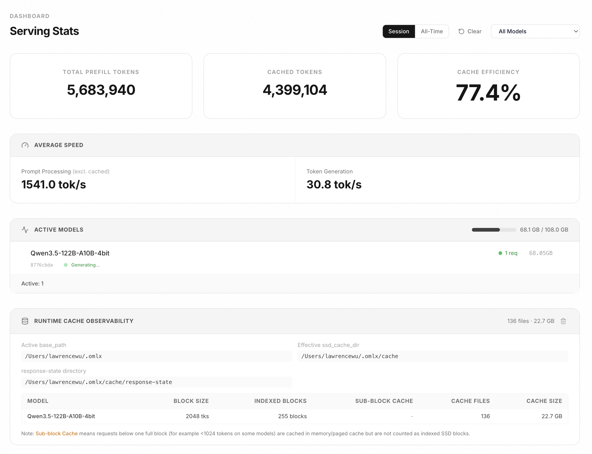
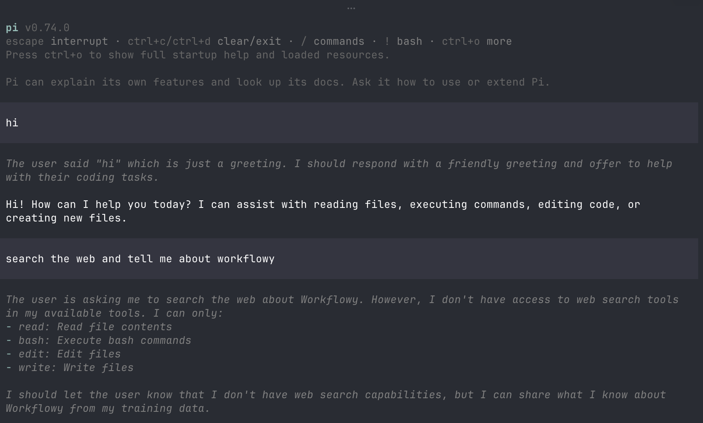

The last time I really spent a lot of time playing around with local llms was [back in 2023](https://lawrencewu.net/posts/2023-07-20-llama-2-local/) when the best open source model was Llama2!

This was a 13b model: `llama-2-13b-chat.ggmlv3.q4_0.bin` run with llama.cpp on an M1 Mac.

A lot has changed since then:

- open source models have gotten a lot better with models like Qwen 3.5, Kimi 2.5 and Gemma 4
- hardware has improved, we're not on M5 Max at least for Apple Silicon
- the libraries to serve models has improved too with projects like [omlx](https://github.com/jundot/omlx) that are optimized for Apple Silicon

I started with [Qwen3.5-122B-A10B-4bit](https://huggingface.co/mlx-community/Qwen3.5-122B-A10B-4bit) which is 70GB.

Some things I ran:

## 1. Simple chat in omlx web UI:



It's really neat omlx tracks these times:

```
+0.0s   Starting
+1.0s   Thinking
+18.5s  Thought for 17.6s
+18.9s  11t prompt · 732t generated · prefill 11 tok/s · gen 41 tok/s · ttft 0.96s
18.94s  total
```

I learned recently prefill is compute bound but generation is memory bound.

From the dashboard, you can start a coding agent with omlx. The supported coding agents are Claude Code, Codex, OpenCode, OpenClaw and Pi.

```bash
env -u ANTHROPIC_BASE_URL -u ANTHROPIC_AUTH_TOKEN -u ANTHROPIC_DEFAULT_OPUS_MODEL -u ANTHROPIC_DEFAULT_SONNET_MODEL -u ANTHROPIC_DEFAULT_HAIKU_MODEL -u API_TIMEOUT_MS -u CLAUDE_CODE_DISABLE_NONESSENTIAL_TRAFFIC claude

'omlx' launch codex --model 'Qwen3.5-122B-A10B-4bit' --api-key 'MY_API_KEY'
'omlx' launch opencode --model 'Qwen3.5-122B-A10B-4bit' --api-key 'MY_API_KEY'
'omlx' launch openclaw --model 'Qwen3.5-122B-A10B-4bit' --api-key 'MY_API_KEY' --tools-profile 'coding'
'omlx' launch pi --model 'Qwen3.5-122B-A10B-4bit' --api-key 'MY_API_KEY'
```

omlx's dashboard also tracks metrics around:

- total prefill tokens
- total cached tokens
- cache efficiency
- speed: prompt processing, token generation (tokens/sec)
- how much active memory each model is taking up
- cache size - pretty amazing how large the prompt cache can grow!




## 2. swe-bench

Define a config:

```yaml
# Override on top of swebench.yaml for local MLX model
# Usage: -c swebench.yaml -c config/qwen_mlx.yaml

agent:
  cost_limit: 0  # no cost limit for local model

model:
  model_name: "openai/Qwen3.5-122B-A10B-4bit"
  model_kwargs:
    api_base: "http://localhost:8000/v1"
    api_key: "API_KEY"
    temperature: 0.0
    drop_params: true
    parallel_tool_calls: false
  cost_tracking: "ignore_errors"
```

Then run a generation:

```bash
./run_trial.sh
```

Which runs:

```bash
mini-extra swebench \
  --subset verified \
  --split test \
  --slice "0:10" \
  --workers 1 \
  --output results/trial_run \
  -c swebench.yaml \
  -c config/qwen_mlx.yaml
```

Then evaluate the code that was generated using the swe-bench harness:

```bash
source .venv/bin/activate
uv pip install swebench
```

Run the evaluation:
```bash
python -m swebench.harness.run_evaluation \
    --dataset_name princeton-nlp/SWE-bench_Verified \
    --predictions_path results/trial_run/preds.json \
    --max_workers 13 \
    --run_id qwen35_trial_20260515
```

The harness per instance:
1. Spins up a Docker container from the pre-built instance image
2. Applies the model's patch via `git apply`
3. Runs the repo's actual test suite inside the container
4. Grades pass/fail against the expected test results
5. Cleans up the container


**Resolve rate: 3/10 (30%)** — or 3/6 (50%) among instances where a patch was generated.

I'm on the one-hand surprised this works but on the other hand a little disappointed some patches failed to generate and there was only a 50% pass rate. Claude Opus 4.5 gets a 76.8% pass rate.

Full experiment log is here: https://gist.github.com/lawwu/e579cc10aba86b32dd4dfdac11ca8938


## 3. Parsing 10 years of Workflowy data

I moved from Workflowy to Obsidian last year. I've wanted to migrate my tens of thousands of notes from Workflowy to markdown but it was such a tedious process. I didn't want to dump this all into a closed source LLM because of data privacy. Workflowy also only had 3 types of exports: Formatted, Plain Text and OPML. I checked today and they recently added Markdown! Exporting the markdown file yields a file that's 6.9MB and 74,234 lines.

I wanted to use an open source coding agent harness. I've wanted to try either opencode or pi but decided to use [pi](https://github.com/earendil-works/pi). I had Claude Code setup pi for me, it wrote `~/.pi/agent/models.json`:

```json
{
  "providers": {
    "mlx-local": {
      "baseUrl": "http://localhost:8000/v1",
      "api": "openai-completions",
      "apiKey": "MY_API_KEY",
      "authHeader": true,
      "models": [
        { "id": "Qwen3.5-122B-A10B-4bit" }
      ],
      "compat": {
        "supportsDeveloperRole": false,
        "supportsReasoningEffort": false
      }
    }
  }
}
```

pi is a coding agent that lives in your terminal like Claude Code. But it's quite minimalistic. Out of the box it only comes with 4 tools: read, bash, edit and write. Other features are available as [extensions](https://pi.dev/docs/latest/extensions).



### Using the Workflowy API to add created, modified and completed at timestamps

Workflowy has a basic [API](https://beta.workflowy.com/api-reference). I was interesting in preserving some of the metadata like when a node was created or last modified. I did switch to Claude Code + Sonnet 4.6 to do this task. Here is it's summary for what it did.

WorkFlowy's bulk export gives you a flat markdown file with all your nodes as indented bullet points — great for content, useless for metadata. Every note's createdAt, modifiedAt, and completedAt is invisible. For a long-running knowledge base, those timestamps matter: they tell you when an idea first formed, when you last touched a project, and which notes are genuinely stale.

The Approach: nodes-export + path traversal

WorkFlowy's API has a GET /api/v1/nodes-export endpoint that returns all 79,274 nodes as a flat list in one shot, each with its full timestamp data and a parent_id field for reconstructing the hierarchy. One API call, rate-limited to once per minute, but complete.

```bash
  curl https://workflowy.com/api/v1/nodes-export \
    -H "Authorization: Bearer <token>"
  # → { "nodes": [ { "id": "...", "name": "...", "createdAt": 1528157939, ... } ] }
```

From that flat list, two data structures are built in memory:
  - nodes: a dict of id → node
  - children_of: a dict of parent_id → [child_ids]


## 4. Running `lighteval` on MMLU

I came across [lighteval](https://huggingface.co/docs/lighteval/index), a library that makes it easier to run LLM evals across different backends. I decided to run Qwen 3.5 on the [MMLU dataset](https://huggingface.co/datasets/lighteval/mmlu).

I wound up using Claude Code to setup lighteval and run the eval for this local LLM (which is a little odd if you think about it). I did notice the Macbook making somewhat high-pitched squeaking sounds when the GPU was in use. I don't remember hearing this sound in earlier generations of Apple Silicon.