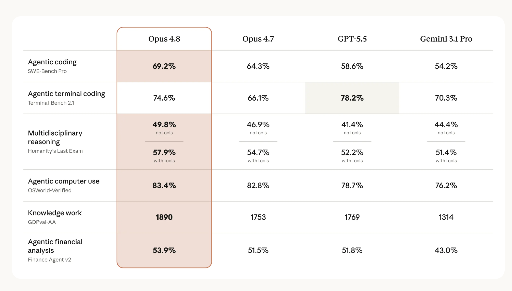
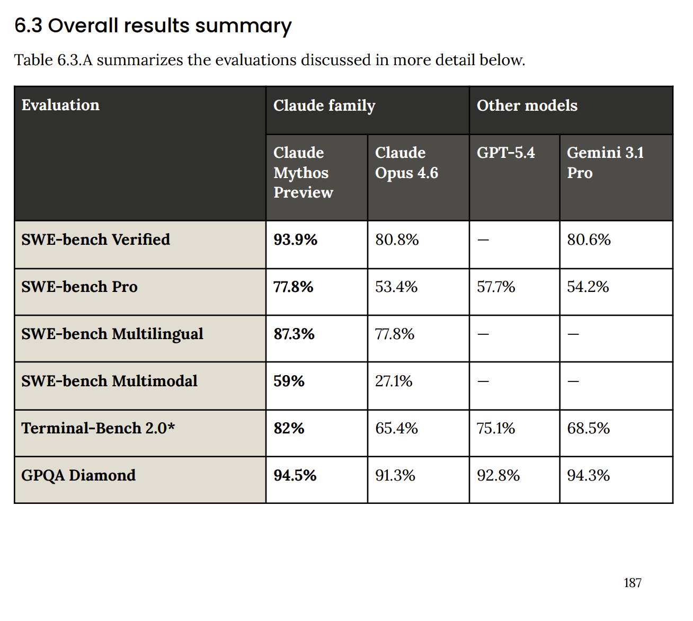
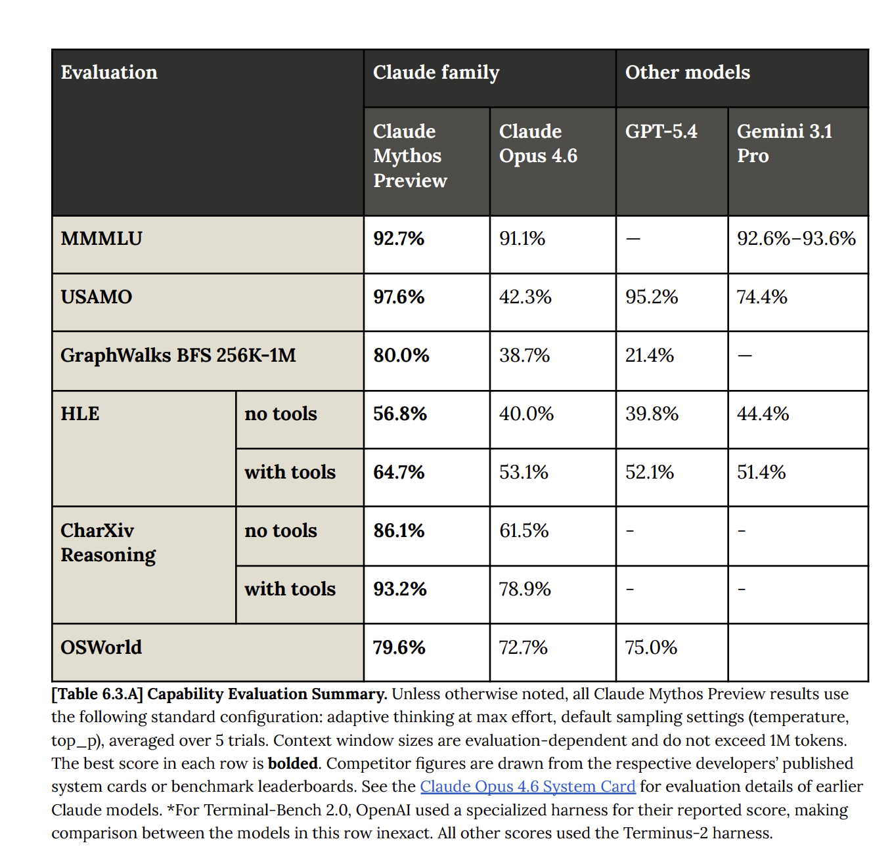
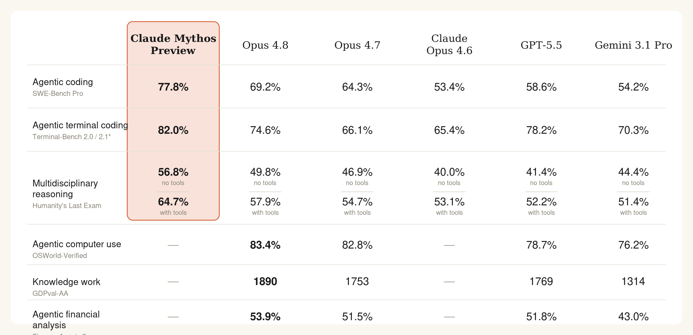

[Claude Opus 4.8 was released today](https://www.anthropic.com/news/claude-opus-4-8).

The comparisons to Opus 4.7 and GPT 5.5 were quite strong.

I was surprised Anthropic didn't put Mythos Preview as a model they are comparing against. Naturally I was curious whether Opus 4.8 was better than Mythos Preview (which was released almost 2 months ago on 2026-04-07).

I went back and looked at the [Mythos Preview System Card](https://www-cdn.anthropic.com/8b8380204f74670be75e81c820ca8dda846ab289.pdf) and saw these two tables on page 187-188 that show Mythos Preview's performance on these common benchmarks.

I then asked Claude Opus 4.8 (in Claude Cowork) to add Mythos Preview and Opus 4.6 scores for SWE-bench pro, Terminal-Bench 2.0 (though 4.8 is using Terminal-Bench 2.1) and Humanity's Last Exam to the same table.

It generated a [SVG](https://gist.github.com/lawwu/876d172d9a129a7658e6590cb11f828c) and then converted it to a PNG. The code for the SVG is [here](https://gist.github.com/lawwu/876d172d9a129a7658e6590cb11f828c). This is the result:

I'm pretty happy with the result. I don't have Anthropic's font handy to make it exactly the same but figured it's close enough. Opus 4.8 still lags Mythos Preview. It's pretty amazing there is still room to improve these large language models. There are rumors that a Mythos class model will be [available soon](https://www.cnet.com/tech/services-and-software/anthropic-claude-opus-4-8-release-mythos-class-ai-model-soon/).
