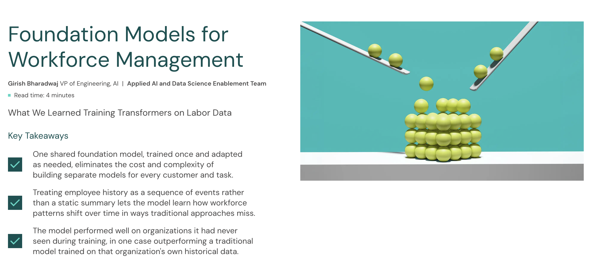

I love reading technical blogs at other companies. I've learned so much from blogs especially ones from [Anthropic](https://www.anthropic.com/engineering) and [LangChain](https://www.langchain.com/blog). It's exciting that we're starting one at UKG. One of the posts, [Foundation Models for Workforce Management](https://www.ukg.com/company/newsroom/engineering-blog/foundation-models-workforce-management) showcases some of the work my AI team at UKG has been working on.

I believe most companies that have large datasets can train these types of domain-specific models that use domain specific vocabulary/tokens. Stripe for example has done something similar in the [payments](https://x.com/thegautam/status/1920198569308664169) space. The article talks about a 2-stage training phase:

1. Phase 1 - Pretraining: We first train the Workforce Foundation Model to predict what tends to happen next in a worker’s behavioral sequence. In plain English, the model reads large amounts of historical labor data and learns common workforce patterns.
2. Phase 2 - Task Adaptation: We then freeze the pretrained model and train LoRA adapters for a downstream problem such as overtime forecasting.

We trained a single model across 5 retail customers on 12.6 million rows of data. This workforce foundation model outperformed a traditional model on 4 out of 5 of the customers and reduced average prediction error by 2.7%. What was even more amazing though was the model was predictive on tenants that were not part of the training data! On one unseen tenant the workforce foundation model even outperformed a traditional ML model trained on that customer's data.

I don't think my team and I would have been able to undertake this research without coding agents like Claude Code. We could go way deeper in an area we were familiar with: machine learning and deep learning.
