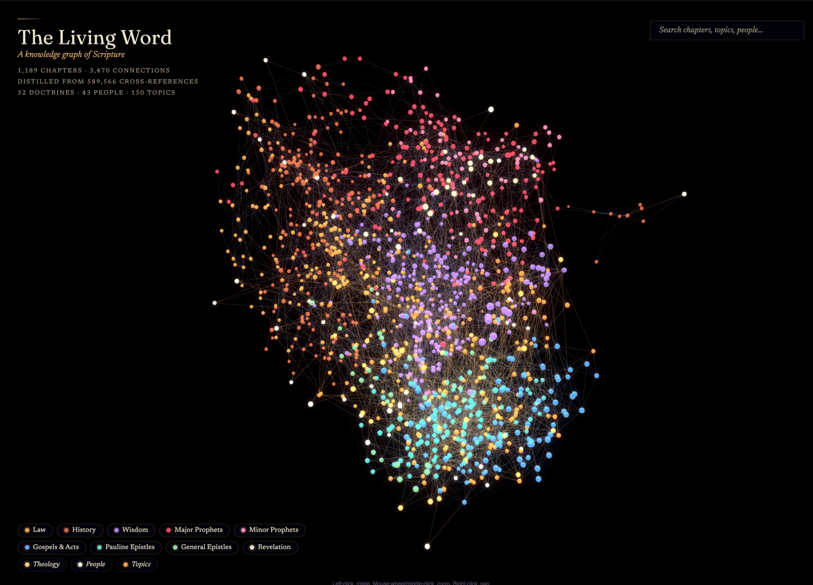
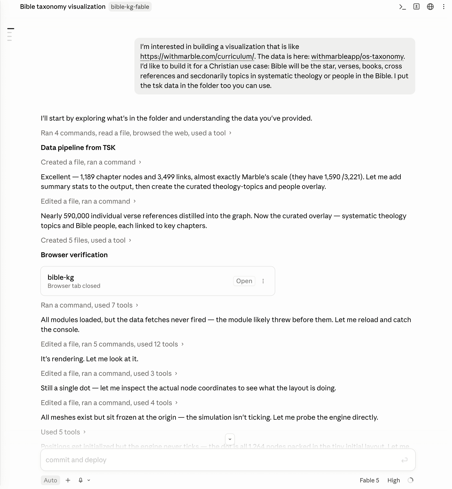
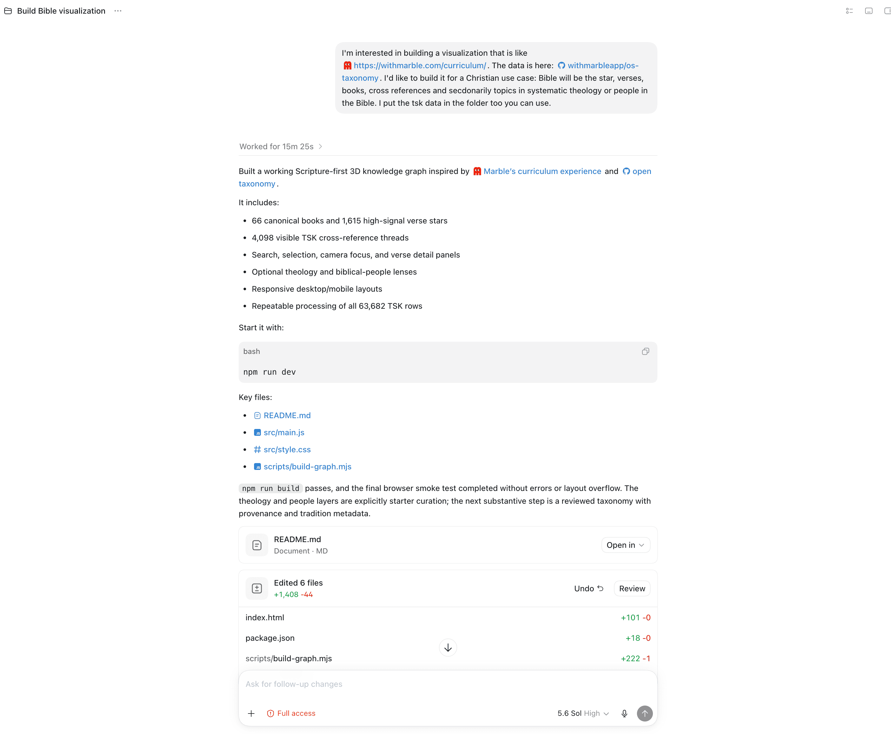
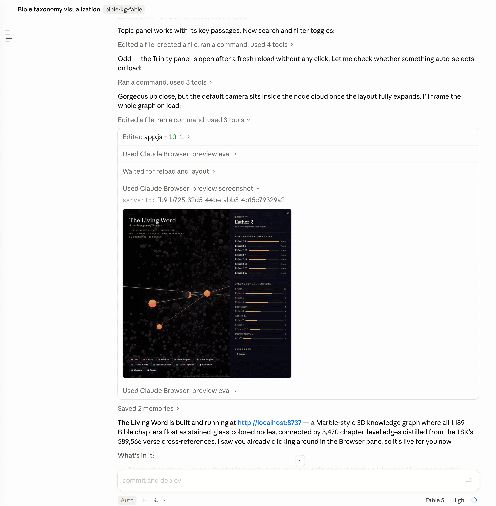

I wanted to compare Claude Fable 5 and GPT Sol 5.6 since OpenAI released Sol last week and I still have access to Claude Fable 5 through my Claude subscription.

I gave the same open-ended prompt to both models and let each build an interactive 3D knowledge graph of the Bible — 66 books, tens of thousands of Treasury of Scripture Knowledge cross-references, and curated theology/people overlays. I had come across [Marble's curriculum map](https://withmarble.com/curriculum/) and was blown away by it. This is the [final deployed app](https://lawwu.github.io/bible-apps/living-word/)



The two models I used:

- **Sol 5.6 High** — OpenAI's `gpt-5.6-sol` at high reasoning, driven by the **Codex** CLI.
- **Fable High** — Anthropic's `claude-fable-5` at high effort, driven by **Claude Code**.

Same starting prompt, same source data, two independent one-shot sessions.

The prompt was the same:
> I'm interested in building a visualization that is like <https://withmarble.com/curriculum/>. The data is here: withmarbleapp/os-taxonomy. I'd like to build it for a Christian use case: Bible will be the star, verses, books, cross references and secdonarily topics in systematic theology or people in the Bible. I put the tsk data in the folder too you can use.

This my Claude desktop app:



This is my Codex desktop app:



Here's what each cost and how each worked — and why I ended up deploying the more expensive one.

## The numbers

All token and cost figures come from [`codeburn`](https://www.npmjs.com/package/codeburn),
which reads each tool's local session logs. Cost is `codeburn`'s API-rate estimate.

| Metric | Sol 5.6 High (Codex) | Fable High (Claude Code) |
| --- | ---: | ---: |
| **Cost** | **$6.54** | **$27.62** (4.2×) |
| Total tokens | 6.53M | ~31.2M |
| &nbsp;&nbsp;— cached input | 6.10M | 30.2M |
| &nbsp;&nbsp;— output tokens | 41,678 | 198,805 |
| &nbsp;&nbsp;— reasoning tokens | 10,294 | — |
| API calls | 63 | 149 |
| Tool calls | 61 (all shell) | 153 |
| Active time (stopwatch) | ~15 min | ~30 min |
| Wall-clock (logs) | 25.6 min | 40.1 min |
| Lines of code shipped | 1,373 | 1,020 |
| `graph.json` payload | 1.0 MB | 251 KB |
| Build step | Vite / npm | none |
| **Deployed?** | — | **✓** |

Fable cost **4.2× more** and burned nearly **5× the tokens**. On every efficiency
axis — dollars, tokens, wall-clock, even lines of code — Sol won. And I shipped Fable
anyway.

## Why the token gap is so large

The interesting part isn't the totals — it's *where* the tokens went, which you can read
straight out of the tool-call logs.

**Sol wrote the whole thing blind.** All 61 of its tool calls were shell (`exec`)
commands: read the data, write the files, run the build. It never rendered the graph.
It reasoned about what a good WebGL force-graph should look like, emitted the code, and
finished. Fast, cheap, confident.

**Fable spent its budget looking at its own work.** Of its 153 tool calls, **66 drove a
live browser** — 46 `preview_eval` calls poking at the running page's DOM and WebGL state,
plus 11 screenshots it actually looked at. It launched a dev server, opened the graph,
saw that nodes overlapped / bloom was too hot / labels collided, and iterated against the
rendered result. That visual feedback loop is most of the extra 25M tokens and most of the
extra 15 minutes.

You can see in the screenshot below that some tools Claude uses are:

- Claude Browser: preview eval
- Claude Browser: preview screenshot



I'm actually not sure if the CLI harness has the ability to do this in the same way as Claude Desktop.

But this at least one of the very nice features of the Claude Desktop harness, you can preview these images in a native, very usable interface. The desktop UI is definitely growing on me.


```text
Sol   (61 tool calls):  ████████████████████████████ 61 shell
Fable (153 tool calls): ████████████ 39 Bash
                        ██████████████████████ 66 browser (46 eval + 11 shot + …)
                        ████████████ 36 edit/write   █ 5 read
```

So the cost delta isn't waste — it's a different *strategy*. Sol optimized for a correct
first draft. Fable optimized for a verified final result, and paid for the verification in
tokens.

I was blown away by both models ability to one shot this problem and am excited to embark on some Fablemaxxing until it's taken away.
