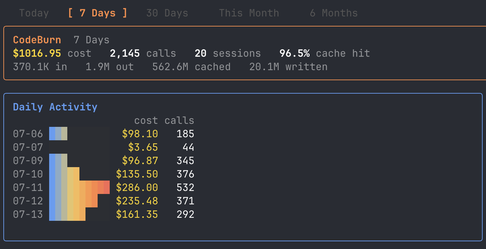
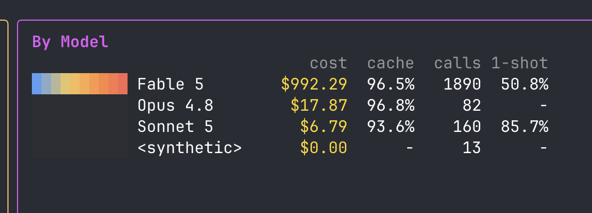

Since Fable 5 came back online, you've been allowed to use it in the Claude subscription. Anthropic has said that at a certain point they would remove it from the subscription and you'd have to pay per token for Fable. They've pushed back 3 times now. The latest date is now July 19:

> Claude Fable 5 was set to start drawing from usage credits on July 13, but we’ve extended our promotion period and it now stays in your plan through Sunday, July 19 at 11:59 pm PT.

I've used around $1,000 of Fable 5 tokens in the last 7 days on my subscription plan.

I've had fun pushing Fable 5 to its limits. I think what it's pushed me to do is to be more ambitious with my ideas and projects.

For example I had a backlog of ideas I've been compiling over the last 5+ years. I haven't had time to work on any of these things. Thinking Fable could help out, I just exported the list as a CSV from Todoist and had Fable rank order the projects and start implementing them. I was pleasantly surprised that Fable did a pretty good job on most of them.

It'll be interesting if Anthropic pushes back the date again this weekend. With GPT 5.6 Sol being competitive with Fable, I expect if OpenAI keeps Sol in the OpenAI subscription, Anthropic will likely hae to do the same with Fable in order to stay competitive with consumers.
